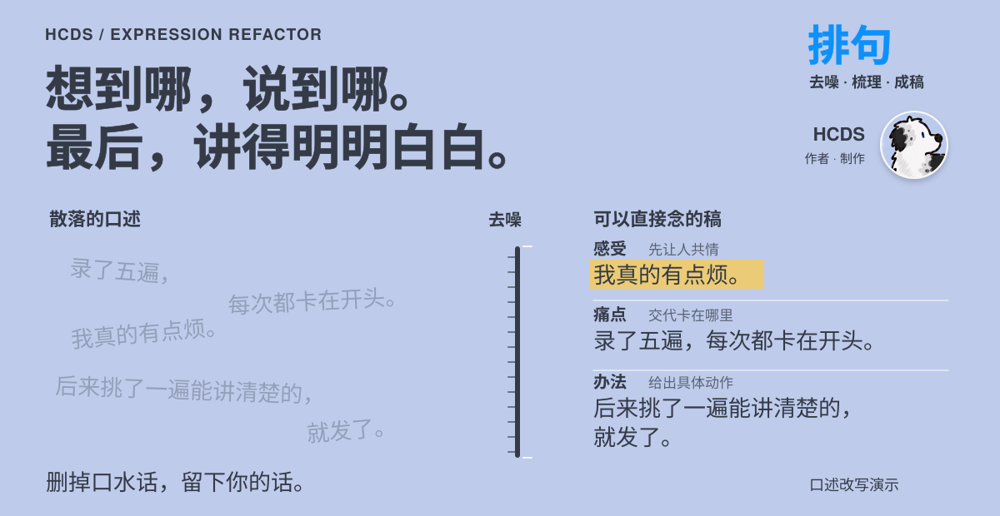

<p align="center">
  
</p>

# 口播改稿 Skill · Spoken Script Editor

**你负责平铺直叙地讲，AI 帮你组织成让人愿意听下去的口播脚本。**

想到哪说到哪也没关系。把你的经历、想法、方法交给 AI，它会从七种叙事结构中选出合适的一种，调整开头、顺序和表达，输出可以直接念的逐字稿。

[看改稿案例](#先看一段改稿) · [开始使用](#开始使用) · [查看 Skill](skills/spoken-script-editor/SKILL.md) · [MIT License](LICENSE)

## 先看一段改稿

### “我想分享拍视频的经验，但一开口就是流水账。”

**你只需要这样说：**

> 我最近想做口播，买了灯和麦克风，桌子也收拾了。结果每次坐下来还是不知道怎么开头，就一直重录。后来有次我先给朋友发语音，把想说的事讲了一遍，再把语音转成文字，删掉重复的话，录的时候就顺了。我想讲的是，设备不是没用，但对当时的我来说，先把话说清楚更有帮助。

**它会这样组织：**

> 灯买了，麦克风也买了，可我坐到镜头前，还是一句开头录了又录。
>
> 后来让我录得顺一点的，是先给朋友发了条语音。
>
> 我没想着“我要录一条视频”，就把想说的事跟朋友讲了一遍。转成文字，再删掉重复的话，我终于知道自己到底要讲什么了。
>
> 设备当然有用。但对当时的我来说，先把话说清楚，比继续折腾桌上的设备更有帮助。
>
> 如果你也卡在开口这一步，可以先试着把这件事讲给一个朋友听。

**选用：结果复盘型。** 先展示“设备齐了，表达仍卡住”的具体处境，提前给出转折，再解释操作过程。保留原意，没有把“设备也有用”改成“设备根本不重要”。

*本页及案例库均为设计的演示素材与改写示范，用于展示工作方式；不是用户证言、实测数据或流量成绩。实际输出随模型和输入而变化。*

## 换一种内容，也能找到讲法

<details>
<summary><strong>观点表达｜“收藏了很多教程，为什么还是没开始？”</strong></summary>

**原始口述**

> 我存了很多剪辑教程，但有次真的开始剪视频，连第一刀切在哪都拿不准。我又去找教程，后来发现自己一直没动手。我改成先剪一版，遇到具体问题再查。我不是想说教程没用，就是觉得我之前收藏的时候以为自己已经在学了。

**改后脚本**

> 我以前把收藏教程，当成了学会剪辑。
>
> 真坐下来剪的时候，第一刀切在哪，我还是拿不准。然后我又打开搜索，去找下一条教程。
>
> 后来我换了个顺序：先剪一版。哪里不会，再去查哪里。
>
> 教程还是那些教程，但我终于带着一个具体问题去看了。
>
> 对我来说，收藏解决的是“下次去哪找”，动手才让我知道“现在到底哪里不会”。如果你也存了很多教程，可以挑一个，做出第一版再说。

**选用：观点论证型。** 先给个人判断，用真实场景支撑，再解释差别，最后落到观众可以尝试的动作。

</details>

<details>
<summary><strong>方法分享｜“怎么让 AI 少写一点套话？”</strong></summary>

**原始口述**

> 我之前让 AI 帮我写自我介绍，只说自然一点，它写出来还是很像模板。后来我给了它三样东西：我要讲给谁听，我做过的一件具体事，还有我平时说话的一小段。出来的稿子更接近我了，但我还是会自己改。我想把这个办法分享出来。

**改后脚本**

> 我跟 AI 说“写自然一点”，它还是给了我一篇模板式的自我介绍。
>
> 后来我发现，我只告诉了它想要什么感觉，却没告诉它：我到底是谁，要对谁说。
>
> 我开始给它三样东西。
>
> 第一，这段介绍要讲给谁听。第二，我做过的一件具体事。第三，我平时说话的一小段。
>
> 这之后，出来的稿子更接近我了。我还是会自己改，但至少它有具体材料可以参考。
>
> 下次你让 AI 写介绍，也可以先补这三样，再让它动笔。

**选用：问题解决型。** 从实际困扰切入，解释材料缺口，再给可以照做的步骤。

</details>

<details>
<summary><strong>成长记录｜“才坚持到第三天，还没有结果，能拍吗？”</strong></summary>

**原始口述**

> 我打算连续七天每天录一分钟口播，今天第三天。第一天总想背稿，忘了就重来。第二天我改成只写三个关键词。今天还是会卡，但能讲完一遍了。还不知道七天之后怎么样，我准备继续用关键词的方法试试。

**改后脚本**

> 练口播的第三天，我终于能把一分钟讲完了。还是会卡，但这次没有忘一句就从头重来。
>
> 我给自己定了个小目标：连续七天，每天录一分钟。
>
> 第一天，我一直想把稿子背下来，结果忘了就重录。第二天，我改成只写三个关键词。今天就顺着这三个词，把想说的讲完。
>
> 七天后会怎么样，我还不知道。接下来我准备继续这样练，看看能不能讲得更顺一点。

**选用：挑战记录型。** 阶段进展先吸引注意，再交代目标和调整；没有把第三天写成七天成功。

</details>

[查看四组完整案例及改写要点 →](examples/before-after.md)

## 它怎么把你的话变成脚本？

**原始口述 → 判断观众为什么在意 → 选择主结构 → 重排材料 → 优化开头和语气 → 交付逐字稿。**

这套 Skill 将内容创作中常用的叙事方法整理成明确的选择规则。它会判断你是想教方法、讲观点、做复盘，还是记录一段生活；每次选一个主结构，再按需加入反差、好奇问题、具体收益和口语化表达。

| 你想讲什么 | 它优先怎么组织 |
|---|---|
| 一个具体问题怎么解决 | 困扰 → 原因 → 步骤 → 行动 |
| 我对这件事的看法 | 观点 → 依据 → 解释 → 与观众的关系 |
| 我做成了什么／发现了什么 | 结果 → 背景 → 关键过程 → 复盘 |
| 两种做法为什么不一样 | 差别 → 案例 → 拆解 → 方法 |
| 我正在尝试一个目标 | 目标 → 行动 → 调整 → 进展 → 下一步 |
| 我整理了一套经验 | 痛点 → 收获 → 经验依据 → 分点方法 |
| 今天发生了一件小事 | 心情 → 事件 → 反应 → 感受 |

你不用先学会这些公式。**把事情说清楚，结构交给 AI 选。** 想法还没定时，也可以只让它给提纲。

## 开始使用

### 安装到支持 Skills 的 AI 工具

需要能运行 `npx` 的 Node.js 环境，使用 Skills CLI：

```bash
npx skills add JinghaoHCDS/spoken-script-editor --skill spoken-script-editor
```

按安装器提示选择目标工具与安装范围。具体调用方式取决于使用的 AI 工具。

安装后，在支持 `$skill-name` 调用的工具中输入：

```text
请用 $spoken-script-editor 把下面的口述改成可以直接念的口播稿。
先判断适合什么结构，保留我的真实经历和说话习惯，不要补编事实。

我想说的是：
[直接粘贴你的口述，想到哪说到哪也可以]
```

### 不安装，先试一遍

把 [SKILL.md](skills/spoken-script-editor/SKILL.md)、[结构细则](skills/spoken-script-editor/references/structures.md)、[开头与表达](skills/spoken-script-editor/references/expression.md) 的正文一起提供给 AI，再发你的口述即可。

普通聊天工具无法自动访问相对文件链接，所以需要同时提供这三个文件，或将它们上传到工具支持的知识库。

### 还可以这样用

```text
我还不想写全文。先根据这段想法，推荐一种结构，
把我的材料排成提纲，并写两句开头给我看看。
```

```text
改成大约一分钟、像跟朋友聊天的口播。
保留我说“其实我也没完全想明白”的那一段，不要写成成功学。
```

```text
保留这个结构，但结尾别求关注。
让我落回自己这次真正学到的东西。
```

## 你会拿到什么

- **完整逐字稿**：可以直接念，不夹杂镜头、花字和分析批注。
- **结构选择理由**：解释为什么这种讲法适合这次内容。
- **简短改动说明**：告诉你调整了什么，方便改回自己的语气。
- **必要的材料缺口**：有缺口才问，不为套模板编故事。

这是给 AI 使用的文字 Skill，不是独立剪辑软件。它不需要自己的 API Key；运行它的 AI 工具可能有账号、模型或费用要求。它帮助优化社交媒体口播的观看理由、信息顺序和表达，不承诺播放、涨粉或转化结果。

## 一起把案例做得更好

欢迎通过 Issue 或 PR 分享：原始口述、实际输出、你觉得不合适的地方，以及期待保留的表达。请仅提交愿意公开的素材。

改进结构规则时，优先附一个能说明问题的案例；一个具体的改稿差异，比再加十条抽象要求更有帮助。

## License

[MIT](LICENSE)。可以使用、修改和分发本仓库中的 Skill 与示例，保留许可证声明。
